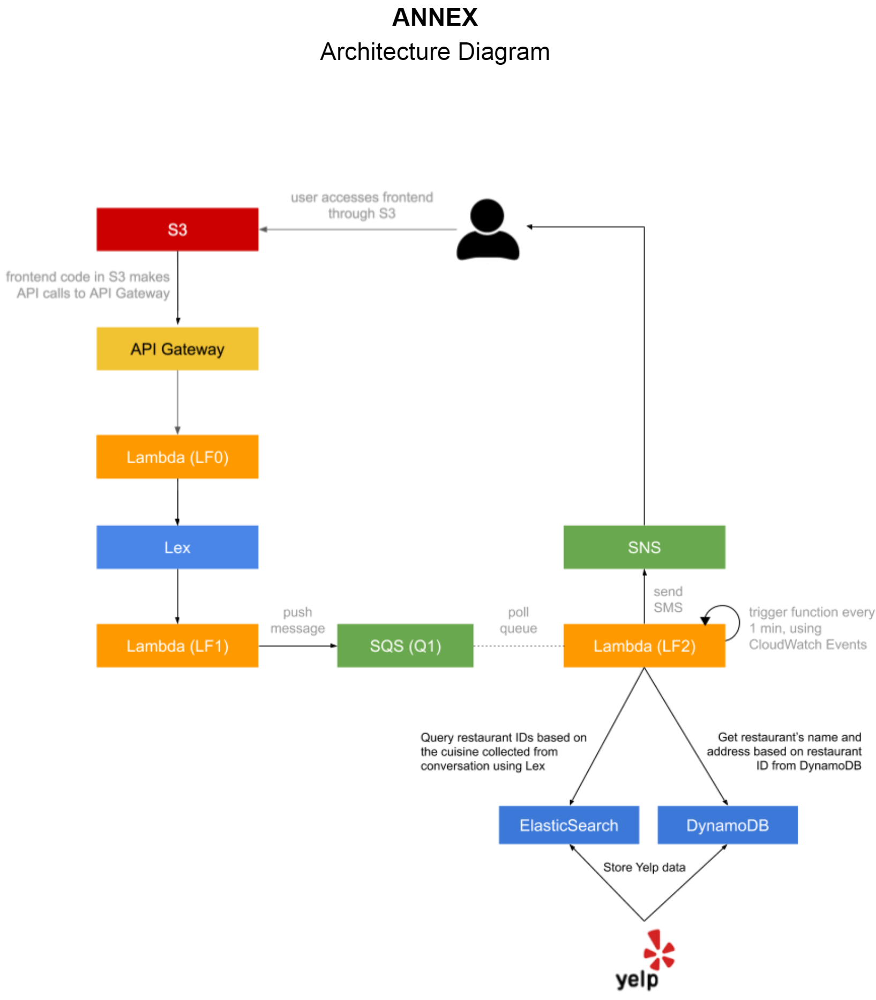

# Overview

- Collection: AWS-based serverless cloud applications
    - [Malika Keller Dining Concierge Chatbot](https://github.com/HyperTars/Malika-Keller-Dining-Concierge-Chatbot)
    - [Smart Door Authentication System](https://github.com/HyperTars/Smart-Door-Authentication-System)
    - [Voice Controlled Photo Search](https://github.com/HyperTars/Voice-Controlled-Photo-Search)
    - [Spam Tagging System](https://github.com/HyperTars/Spam-Tagging-System)
    
- Malika Keller Dining Concierge Chatbot is an AWS-based serverless cloud application that sends you restaurant suggestions given a set of preferences that you provide the chatbot with through conversation.

  - Based on a conversation with the customer, LEX chatbot will identify the customer's preferred 'cuisine'.
  
  - Then it will search through Elastic Search to get random suggestions of restaurant IDs with this cuisine.

- Example 
  - Interaction

    **User: Hello**

    Bot: Hi there, how can I help?

    **User: I need some restaurant suggestions.**

    Bot: Great. I can help you with that. What city or city area are you looking to dine in?

    **User: Manhattan**

    Bot: Got it, Manhattan. What cuisine would you like to try?

    **User: Japanese**

    Bot: Ok, how many people are in your party?

    **User: Two**

    Bot: A few more to go. What date?

    **User: Today**

    Bot: What time?

    **User: 7 pm, please**

    Bot: Great. Lastly, I need your phone number so I can send you my findings.

    **User: 123-456-7890**

    Bot: You’re all set. Expect my suggestions shortly! Have a good day.

    **User: Thank you!**

    Bot: You’re welcome

  - User gets the following text message:

    “Hello! Here are my Japanese restaurant suggestions for 2 people, for today at 7 pm: 1.
    Sushi Nakazawa, located at 23 Commerce St, 2. Jin Ramen, located at 3183 Broadway, 3. 
    Nikko, located at 1280 Amsterdam Ave. Enjoy your meal!”
  
- AWS services used:
  - S3
  - API Gateway
  - Lambda
  - Lex
  - SQS
  - SNS
  - Elastic Search
  - DynamoDB

- Supporting Area: Manhattan (Data From Yelp)
  - AREA_ZIP = ```
            'Central Harlem, Manhattan': [10026, 10027, 10030, 10037, 10039],
            'Washington Heights, Manhattan': [10031, 10032, 10033, 10034, 10040],
            'East Harlem, Manhattan': [10029, 10035],
            'Upper West Side, Manhattan': [10023, 10024, 10025],
            'Upper East Side, Manhattan': [10021, 10028, 10044, 10065, 10075, 10128],
            'Midtown West, Manhattan': [10019, 10020],
            'Midtown East, Manhattan': [10022],
            'Chelsea, Manhattan': [10001, 10011, 10018, 10036],
            'Murray Hill, Manhattan': [10017],
            'Gramercy, Manhattan': [10010, 10016],
            'Greenwich, Manhattan': [10012, 10014],
            'East Village, Manhattan': [10003, 10009],
            'Soho, Manhattan': [10013],
            'Lower East Side, Manhattan': [10002],
            'Tribeca, Manhattan': [10282, 10007],
            'Chinatown, Manhattan': [10038],
            'Financial District, Manhattan': [10006, 10280, 10005, 10004]
            ```
            
- See full [Instructions](Instruction.pdf)

- Architecture Diagram


